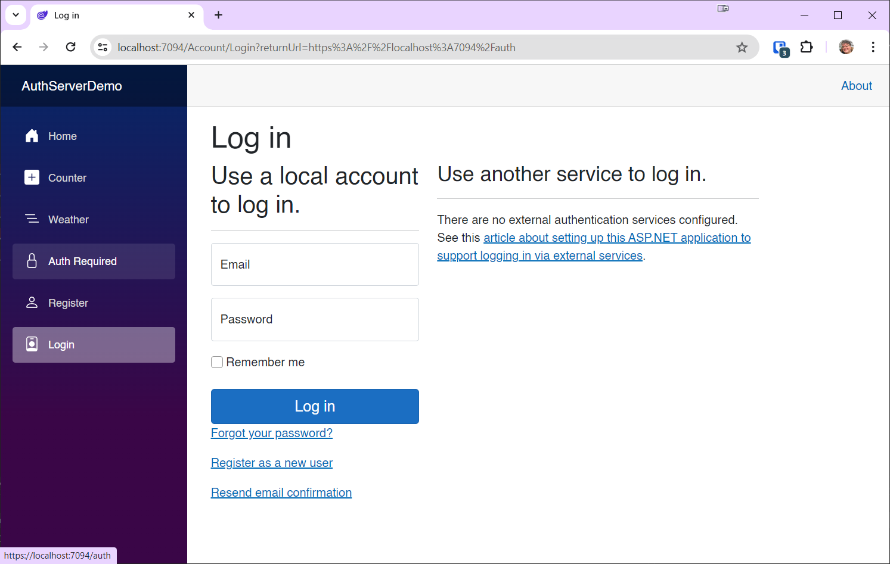
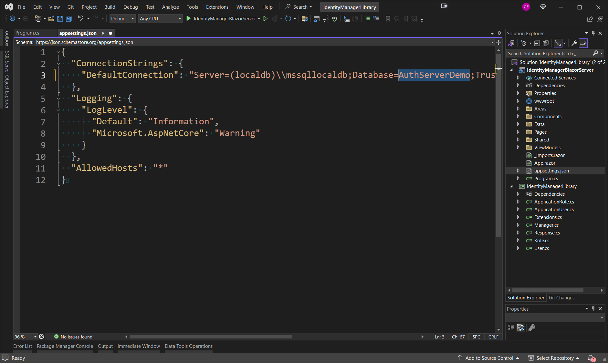

# Basic Authentication and Authorization

In this module you will learn:

1. How to use the built-in AspNetCore.Identity system to allow users to register and log in
2. How to apply roles to users using IdentityManager
3. How to authorize markup based on the user's' roles
4. How to authorize code based on the user's roles

## Blazor Server

#### Create a new Global Server Blazor Web App called AuthServerDemo


Make sure the following options on the next screen are selected:


By selecting "Individual Accounts" for the Authentication Type, you get just about everything you need to secure your app including user registration, log in and log out, and authorization based on whether the user is logged in or not, and with a single line of code, roles.

Let's take a look at the project, specifically under the *Components\\Account* folder:


In previous versions of .NET, all of these UI elements would have to be added with scaffolding. More significantly, they would all be razor pages (.cshtml) rather than Blazor pages and components.

Note that there are also a bunch of new plumbing classes.

If you expand the *Manage* folder, you'll see a bunch of pages for managing accounts:


Many of these new features require an email server. The documentation is very good. For more information see **[Select and configure an email provider](https://learn.microsoft.com/en-us/aspnet/core/blazor/security/server/account-confirmation-and-password-recovery?view=aspnetcore-8.0#select-and-configure-an-email-provider)**

There are a few other areas of interest in the project template:


##### Migrations

Migrations are a feature of Entity Framework Core (EF Core) that enables you to manage database schema changes over time. Migrations allow you to update the database schema as your application evolves, without the need to drop the database and recreate it from scratch each time the data model changes. This is especially useful in applications with production data that you need to preserve across updates.

The template comes with a migration to create the initial database from scratch. The filename starts with a bunch of zeros so it is nearly always the first migration in the list when sorted alphabetically.

Check out the file *00000000000000_CreateIdentitySchema.cs*:

```c#
using Microsoft.EntityFrameworkCore.Migrations;
using System;

#nullable disable

namespace AuthServerDemo.Migrations
{
    /// <inheritdoc />
    public partial class CreateIdentitySchema : Migration
    {
        /// <inheritdoc />
        protected override void Up(MigrationBuilder migrationBuilder)
        {
            migrationBuilder.CreateTable(
                name: "AspNetRoles",
                columns: table => new
                {
                    Id = table.Column<string>(type: "nvarchar(450)", nullable: false),
                    Name = table.Column<string>(type: "nvarchar(256)", maxLength: 256, nullable: true),
                    NormalizedName = table.Column<string>(type: "nvarchar(256)", maxLength: 256, nullable: true),
                    ConcurrencyStamp = table.Column<string>(type: "nvarchar(max)", nullable: true)
                },
                constraints: table =>
                {
                    table.PrimaryKey("PK_AspNetRoles", x => x.Id);
                });

            migrationBuilder.CreateTable(
                name: "AspNetUsers",
                columns: table => new
                {
                    Id = table.Column<string>(type: "nvarchar(450)", nullable: false),
                    UserName = table.Column<string>(type: "nvarchar(256)", maxLength: 256, nullable: true),
                    NormalizedUserName = table.Column<string>(type: "nvarchar(256)", maxLength: 256, nullable: true),
                    Email = table.Column<string>(type: "nvarchar(256)", maxLength: 256, nullable: true),
                    NormalizedEmail = table.Column<string>(type: "nvarchar(256)", maxLength: 256, nullable: true),
                    EmailConfirmed = table.Column<bool>(type: "bit", nullable: false),
                    PasswordHash = table.Column<string>(type: "nvarchar(max)", nullable: true),
                    SecurityStamp = table.Column<string>(type: "nvarchar(max)", nullable: true),
                    ConcurrencyStamp = table.Column<string>(type: "nvarchar(max)", nullable: true),
                    PhoneNumber = table.Column<string>(type: "nvarchar(max)", nullable: true),
                    PhoneNumberConfirmed = table.Column<bool>(type: "bit", nullable: false),
                    TwoFactorEnabled = table.Column<bool>(type: "bit", nullable: false),
                    LockoutEnd = table.Column<DateTimeOffset>(type: "datetimeoffset", nullable: true),
                    LockoutEnabled = table.Column<bool>(type: "bit", nullable: false),
                    AccessFailedCount = table.Column<int>(type: "int", nullable: false)
                },
                constraints: table =>
                {
                    table.PrimaryKey("PK_AspNetUsers", x => x.Id);
                });

            migrationBuilder.CreateTable(
                name: "AspNetRoleClaims",
                columns: table => new
                {
                    Id = table.Column<int>(type: "int", nullable: false)
                        .Annotation("SqlServer:Identity", "1, 1"),
                    RoleId = table.Column<string>(type: "nvarchar(450)", nullable: false),
                    ClaimType = table.Column<string>(type: "nvarchar(max)", nullable: true),
                    ClaimValue = table.Column<string>(type: "nvarchar(max)", nullable: true)
                },
                constraints: table =>
                {
                    table.PrimaryKey("PK_AspNetRoleClaims", x => x.Id);
                    table.ForeignKey(
                        name: "FK_AspNetRoleClaims_AspNetRoles_RoleId",
                        column: x => x.RoleId,
                        principalTable: "AspNetRoles",
                        principalColumn: "Id",
                        onDelete: ReferentialAction.Cascade);
                });

            migrationBuilder.CreateTable(
                name: "AspNetUserClaims",
                columns: table => new
                {
                    Id = table.Column<int>(type: "int", nullable: false)
                        .Annotation("SqlServer:Identity", "1, 1"),
                    UserId = table.Column<string>(type: "nvarchar(450)", nullable: false),
                    ClaimType = table.Column<string>(type: "nvarchar(max)", nullable: true),
                    ClaimValue = table.Column<string>(type: "nvarchar(max)", nullable: true)
                },
                constraints: table =>
                {
                    table.PrimaryKey("PK_AspNetUserClaims", x => x.Id);
                    table.ForeignKey(
                        name: "FK_AspNetUserClaims_AspNetUsers_UserId",
                        column: x => x.UserId,
                        principalTable: "AspNetUsers",
                        principalColumn: "Id",
                        onDelete: ReferentialAction.Cascade);
                });

            migrationBuilder.CreateTable(
                name: "AspNetUserLogins",
                columns: table => new
                {
                    LoginProvider = table.Column<string>(type: "nvarchar(450)", nullable: false),
                    ProviderKey = table.Column<string>(type: "nvarchar(450)", nullable: false),
                    ProviderDisplayName = table.Column<string>(type: "nvarchar(max)", nullable: true),
                    UserId = table.Column<string>(type: "nvarchar(450)", nullable: false)
                },
                constraints: table =>
                {
                    table.PrimaryKey("PK_AspNetUserLogins", x => new { x.LoginProvider, x.ProviderKey });
                    table.ForeignKey(
                        name: "FK_AspNetUserLogins_AspNetUsers_UserId",
                        column: x => x.UserId,
                        principalTable: "AspNetUsers",
                        principalColumn: "Id",
                        onDelete: ReferentialAction.Cascade);
                });

            migrationBuilder.CreateTable(
                name: "AspNetUserRoles",
                columns: table => new
                {
                    UserId = table.Column<string>(type: "nvarchar(450)", nullable: false),
                    RoleId = table.Column<string>(type: "nvarchar(450)", nullable: false)
                },
                constraints: table =>
                {
                    table.PrimaryKey("PK_AspNetUserRoles", x => new { x.UserId, x.RoleId });
                    table.ForeignKey(
                        name: "FK_AspNetUserRoles_AspNetRoles_RoleId",
                        column: x => x.RoleId,
                        principalTable: "AspNetRoles",
                        principalColumn: "Id",
                        onDelete: ReferentialAction.Cascade);
                    table.ForeignKey(
                        name: "FK_AspNetUserRoles_AspNetUsers_UserId",
                        column: x => x.UserId,
                        principalTable: "AspNetUsers",
                        principalColumn: "Id",
                        onDelete: ReferentialAction.Cascade);
                });

            migrationBuilder.CreateTable(
                name: "AspNetUserTokens",
                columns: table => new
                {
                    UserId = table.Column<string>(type: "nvarchar(450)", nullable: false),
                    LoginProvider = table.Column<string>(type: "nvarchar(450)", nullable: false),
                    Name = table.Column<string>(type: "nvarchar(450)", nullable: false),
                    Value = table.Column<string>(type: "nvarchar(max)", nullable: true)
                },
                constraints: table =>
                {
                    table.PrimaryKey("PK_AspNetUserTokens", x => new { x.UserId, x.LoginProvider, x.Name });
                    table.ForeignKey(
                        name: "FK_AspNetUserTokens_AspNetUsers_UserId",
                        column: x => x.UserId,
                        principalTable: "AspNetUsers",
                        principalColumn: "Id",
                        onDelete: ReferentialAction.Cascade);
                });

            migrationBuilder.CreateIndex(
                name: "IX_AspNetRoleClaims_RoleId",
                table: "AspNetRoleClaims",
                column: "RoleId");

            migrationBuilder.CreateIndex(
                name: "RoleNameIndex",
                table: "AspNetRoles",
                column: "NormalizedName",
                unique: true,
                filter: "[NormalizedName] IS NOT NULL");

            migrationBuilder.CreateIndex(
                name: "IX_AspNetUserClaims_UserId",
                table: "AspNetUserClaims",
                column: "UserId");

            migrationBuilder.CreateIndex(
                name: "IX_AspNetUserLogins_UserId",
                table: "AspNetUserLogins",
                column: "UserId");

            migrationBuilder.CreateIndex(
                name: "IX_AspNetUserRoles_RoleId",
                table: "AspNetUserRoles",
                column: "RoleId");

            migrationBuilder.CreateIndex(
                name: "EmailIndex",
                table: "AspNetUsers",
                column: "NormalizedEmail");

            migrationBuilder.CreateIndex(
                name: "UserNameIndex",
                table: "AspNetUsers",
                column: "NormalizedUserName",
                unique: true,
                filter: "[NormalizedUserName] IS NOT NULL");
        }

        /// <inheritdoc />
        protected override void Down(MigrationBuilder migrationBuilder)
        {
            migrationBuilder.DropTable(
                name: "AspNetRoleClaims");

            migrationBuilder.DropTable(
                name: "AspNetUserClaims");

            migrationBuilder.DropTable(
                name: "AspNetUserLogins");

            migrationBuilder.DropTable(
                name: "AspNetUserRoles");

            migrationBuilder.DropTable(
                name: "AspNetUserTokens");

            migrationBuilder.DropTable(
                name: "AspNetRoles");

            migrationBuilder.DropTable(
                name: "AspNetUsers");
        }
    }
}
```

More information can be found at https://learn.microsoft.com/en-us/ef/core/managing-schemas/migrations/?tabs=dotnet-core-cli

#### Identity Database

The first thing to do is create a database for storing identity information (users, password hashes, roles, etc.). The default database is SQL Server, but you can easily use a more lightweight database such as SQLite by adding the SQLite package and changing the configuration in **Program.cs** to use SQLite.

If you're interested in changing over to SQLite, [this discussion on StackOverflow](https://stackoverflow.com/questions/77643209/blazor-web-app-net-8-switch-user-authentication-to-use-sqlite-instead-of-sq) may be helpful.

By default, the database connection string is provided in *appsettings.json*. This is what mine looks like:

```json
{
  "ConnectionStrings": {
    "DefaultConnection": "Server=(localdb)\\mssqllocaldb;Database=aspnet-AuthServerDemo-5de3e311-fe22-4b83-8fc0-3f69a521dadf;Trusted_Connection=True;MultipleActiveResultSets=true"
  },
  "Logging": {
    "LogLevel": {
      "Default": "Information",
      "Microsoft.AspNetCore": "Warning"
    }
  },
  "AllowedHosts": "*"
}
```

The database name will be unique. However, it is not created until either

**a)** You register as a new user and follow on-screen instructions to create the database

​	or

**b)** You run `update-database` in the Package Manager Console window.

Here you have a chance to name it whatever you want. By default it's **aspnet-** followed by the project name, another dash, and then a GUID string. 

Let's change it to the project name only:

```json
{
  "ConnectionStrings": {
    "DefaultConnection": "Server=(localdb)\\mssqllocaldb;Database=AuthServerDemo;Trusted_Connection=True;MultipleActiveResultSets=true"
  },
  "Logging": {
    "LogLevel": {
      "Default": "Information",
      "Microsoft.AspNetCore": "Warning"
    }
  },
  "AllowedHosts": "*"
}
```

To create the database, open the Package Manager Console and execute this command:

```
update-database
```

You'll see the progress of creating the database (applying the migration). When it's complete you'll see the word "Done." like so:


Now if you open the SQL Server Object Explorer, then the **(localdb)\MSSQLLocalDB** folder, then the **Databases** folder, you'll see the **AuthServerDemo** database has been created. If you expand that and look under **Tables** you'll see the tables created.


Let's start by looking at *App.razor*, which is in the *Components* folder:

```c#
<!DOCTYPE html>
<html lang="en">

<head>
    <meta charset="utf-8" />
    <meta name="viewport" content="width=device-width, initial-scale=1.0" />
    <base href="/" />
    <link rel="stylesheet" href="bootstrap/bootstrap.min.css" />
    <link rel="stylesheet" href="app.css" />
    <link rel="stylesheet" href="AuthServerDemo.styles.css" />
    <link rel="icon" type="image/png" href="favicon.png" />
    <HeadOutlet @rendermode="RenderModeForPage" />
</head>

<body>
    <Routes @rendermode="RenderModeForPage" />
    <script src="_framework/blazor.web.js"></script>
</body>

</html>

@code {
    [CascadingParameter]
    private HttpContext HttpContext { get; set; } = default!;

    private IComponentRenderMode? RenderModeForPage => HttpContext.Request.Path.StartsWithSegments("/Account")
        ? null
        : InteractiveServer;
}
```

The `HttpContext` is used to determine the render mode for the page. The `RenderModeForPage` property dynamically determines the render mode for the `<HeadOutlet>` and `<Routes>` components. It checks if the request path starts with `/Account`. If it does, it returns `null` which means that no render mode is applied; otherwise, it uses `InteractiveServer`, meaning that we only want interactivity when not accessing account-related paths.

You can optionally turn off pre-rendering by changing the `RenderModeForPage` property handler to this:

```c#
private IComponentRenderMode? RenderModeForPage =>
    HttpContext.Request.Path.StartsWithSegments("/Account")
        ? null
        : new InteractiveServerRenderMode(false);
```

Let's take a look at the *NavMenu.razor* file, which is in the *Components\\Layout* folder:

```c#
@implements IDisposable

@inject NavigationManager NavigationManager

<div class="top-row ps-3 navbar navbar-dark">
    <div class="container-fluid">
        <a class="navbar-brand" href="">AuthServerDemo</a>
    </div>
</div>

<input type="checkbox" title="Navigation menu" class="navbar-toggler" />

<div class="nav-scrollable" onclick="document.querySelector('.navbar-toggler').click()">
    <nav class="flex-column">
        <div class="nav-item px-3">
            <NavLink class="nav-link" href="" Match="NavLinkMatch.All">
                <span class="bi bi-house-door-fill-nav-menu" aria-hidden="true"></span> Home
            </NavLink>
        </div>

        <div class="nav-item px-3">
            <NavLink class="nav-link" href="counter">
                <span class="bi bi-plus-square-fill-nav-menu" aria-hidden="true"></span> Counter
            </NavLink>
        </div>

        <div class="nav-item px-3">
            <NavLink class="nav-link" href="weather">
                <span class="bi bi-list-nested-nav-menu" aria-hidden="true"></span> Weather
            </NavLink>
        </div>

        <div class="nav-item px-3">
            <NavLink class="nav-link" href="auth">
                <span class="bi bi-lock-nav-menu" aria-hidden="true"></span> Auth Required
            </NavLink>
        </div>

        <AuthorizeView>
            <Authorized>
                <div class="nav-item px-3">
                    <NavLink class="nav-link" href="Account/Manage">
                        <span class="bi bi-person-fill-nav-menu" aria-hidden="true"></span> @context.User.Identity?.Name
                    </NavLink>
                </div>
                <div class="nav-item px-3">
                    <form action="Account/Logout" method="post">
                        <AntiforgeryToken />
                        <input type="hidden" name="ReturnUrl" value="@currentUrl" />
                        <button type="submit" class="nav-link">
                            <span class="bi bi-arrow-bar-left-nav-menu" aria-hidden="true"></span> Logout
                        </button>
                    </form>
                </div>
            </Authorized>
            <NotAuthorized>
                <div class="nav-item px-3">
                    <NavLink class="nav-link" href="Account/Register">
                        <span class="bi bi-person-nav-menu" aria-hidden="true"></span> Register
                    </NavLink>
                </div>
                <div class="nav-item px-3">
                    <NavLink class="nav-link" href="Account/Login">
                        <span class="bi bi-person-badge-nav-menu" aria-hidden="true"></span> Login
                    </NavLink>
                </div>
            </NotAuthorized>
        </AuthorizeView>
    </nav>
</div>

@code {
    private string? currentUrl;

    protected override void OnInitialized()
    {
        currentUrl = NavigationManager.ToBaseRelativePath(NavigationManager.Uri);
        NavigationManager.LocationChanged += OnLocationChanged;
    }

    private void OnLocationChanged(object? sender, LocationChangedEventArgs e)
    {
        currentUrl = NavigationManager.ToBaseRelativePath(e.Location);
        StateHasChanged();
    }

    public void Dispose()
    {
        NavigationManager.LocationChanged -= OnLocationChanged;
    }
}
```

The NavMenu takes advantage of the `<AuthorizeView>` component to show different links depending on whether or not the user is logged in.

If the user is not logged in, the content in `<NotAuthorized>` is shown, which allows the user to either register or log in:

```xml
<NotAuthorized>
    <div class="nav-item px-3">
        <NavLink class="nav-link" href="Account/Register">
            <span class="bi bi-person-nav-menu" aria-hidden="true"></span> Register
        </NavLink>
    </div>
    <div class="nav-item px-3">
        <NavLink class="nav-link" href="Account/Login">
            <span class="bi bi-person-badge-nav-menu" aria-hidden="true"></span> Login
        </NavLink>
    </div>
</NotAuthorized>
```

If the user is logged in (authenticated), the content in `<Authorized>` is shown, which allows the user to manage their account or log out:

```xml
<Authorized>
    <div class="nav-item px-3">
        <NavLink class="nav-link" href="Account/Manage">
            <span class="bi bi-person-fill-nav-menu" aria-hidden="true"></span> @context.User.Identity?.Name
        </NavLink>
    </div>
    <div class="nav-item px-3">
        <form action="Account/Logout" method="post">
            <AntiforgeryToken />
            <input type="hidden" name="ReturnUrl" value="@currentUrl" />
            <button type="submit" class="nav-link">
                <span class="bi bi-arrow-bar-left-nav-menu" aria-hidden="true"></span> Logout
            </button>
        </form>
    </div>
</Authorized>
```

Let's run the app and register as a new user. Click on the **Register** button and register with the email **harry@harrychap.com** with the password **P@ssw0rd**. I hope I don't need to remind you that this password is weak. Passwords like this should not be used in the real world. However, it's simplicity makes it easy to remember for the purposes of the demo.


Next, you will be asked to click a link to confirm your account. Before you click, however, check out the user in the database:


If you expand the **dbo.AspNetUsers** table, you see that the **EmailConfirmed** field is set to false.

Go ahead and click the link to confirm your account:


Now, refresh the table and you'll see the **EmailConfirmed** field is set to True.


Now you are able to log in. Click the **Login** button:


Enter **harry@harrychap.com** and **P@ssw0rd** then select the **Log in** button.


Click the **Auth Required** link:


Let's stop the app and take a look at the *Auth.razor* page:

```html
@page "/auth"

@using Microsoft.AspNetCore.Authorization

@attribute [Authorize]

<PageTitle>Auth</PageTitle>

<h1>You are authenticated</h1>

<AuthorizeView>
    Hello @context.User.Identity?.Name!
</AuthorizeView>
```

This is the key to this page:

```
@attribute [Authorize]
```

With this attribute, if the user navigates to the page and is not authorized, they will be redirected to the log in page. 

Try it. Run the app and try to navigate to the page while not logged in:



You can use `@attribute [Authorize]` in any page that you want to restrict to users that are logged in.

#### Role-Based Authorization

Think of a role as a tag. It's text. Some examples might be "canAccessFinance", "canManage", and "admin". You can make them up and assign them to users.

If you look at the Identity database, you see the following tables:

- dbo.AspNetRoles
- dbo.AspNetUserRoles

This is where you can define roles and assign them to users.

To enable role-based auth in the app we need to make a change in *Program.cs*

Change this:

```c#
builder.Services.AddIdentityCore<ApplicationUser>(options => options.SignIn.RequireConfirmedAccount = true)
    .AddEntityFrameworkStores<ApplicationDbContext>()
    .AddSignInManager()
    .AddDefaultTokenProviders();
```

to this:

```c#
builder.Services.AddIdentityCore<ApplicationUser>(options => options.SignIn.RequireConfirmedAccount = true)
    .AddRoles<IdentityRole>()
    .AddEntityFrameworkStores<ApplicationDbContext>()
    .AddSignInManager()
    .AddDefaultTokenProviders();
```

All we did is add this line:

```
.AddRoles<IdentityRole>()
```

> Note that this must come before `.AddEntityFrameworkStores<ApplicationDbContext>()` in the fluent configuration.

##### Authorize based on role

Let's modify the NavLink the Counter page in NavMenu to require a role named "admin".

Change this:

```xml
<div class="nav-item px-3">
    <NavLink class="nav-link" href="counter">
        <span class="bi bi-plus-square-fill-nav-menu" aria-hidden="true"></span> Counter
    </NavLink>
</div>
```

to this:

```xml
<AuthorizeView Roles="admin">
    <div class="nav-item px-3">
        <NavLink class="nav-link" href="counter">
            <span class="bi bi-plus-square-fill-nav-menu" aria-hidden="true"></span> Counter
        </NavLink>
    </div>
</AuthorizeView>
```

This means the user will only see the link to the Counter page if they are a) logged in, and b) in the admin role.

Run the app and notice that the **Counter** NavLink is not visible, even when logged in:


##### Assigning Roles

There is no real admin code in the app we can use to create roles and assign them to users. The plumbing is there (RoleManager, etc) but there's nothing we can just run to perform these actions. 

There is a good reason for this. We don't want users to be able to assign and change their roles. That's a security risk. We need to have a separate application that administrators can run to manage users and roles.

Fortunately there is such a beast. Download the code from the following repo:

https://github.com/carlfranklin/IdentityManagerLibrary

This is a library developed by App vNext, my consulting company, with an accompanying demo app that you can use right now to manage users and roles.

Load the **IdentityManagerLibrary** solution, ensure that the **IdentityManagerBlazorServer** project is set as the startup project.

Then modify the connection string in *appsettings.json* to point to our identity database:



Run the application, select **Create Role**, enter the word "admin", and hit the **Save** button:


Now select **Users**


Select the **Edit** button, select the **admin** role and click **Save**:


Now our user is in the admin role.

Run the app again. If you are already logged in, log out and log back in again.

You will now see the **Counter** NavLink.


##### Securing Pages with Roles

Just because we restricted access to the **Counter** NavLink, that doesn't mean the user can't just enter the URL to the Counter page to get there.

Change *Counter.razor* to this:

```c#
@page "/counter"
@using Microsoft.AspNetCore.Authorization

@attribute [Authorize(Roles="myrole")]

<PageTitle>Counter</PageTitle>

<h1>Counter</h1>

<p role="status">Current count: @currentCount</p>

<button class="btn btn-primary" @onclick="IncrementCount">Click me</button>

@code {
    private int currentCount = 0;

    private void IncrementCount()
    {
        currentCount++;
    }
}
```

We have specified a require role to access this page:

```c#
@attribute [Authorize(Roles="myrole")]
```

SInce "myrole" doesn't exist and our user is therefore not in that role, we will not be able to access the page even if we are authenticated.

Run the app, log in, and try to access the Counter page:


Well, that's awkward. We are being asked to log in again, even though we are already logged in. We just don't have the required role.

An easy solution is to use an `AuthorizeView` in the page itself. Change *Counter.razor* to this:

```c#
@page "/counter"
@using Microsoft.AspNetCore.Authorization

<PageTitle>Counter</PageTitle>
<h1>Counter</h1>

<AuthorizeView Roles="myrole">
    <Authorized>
        <p role="status">Current count: @currentCount</p>
        <button class="btn btn-primary" @onclick="IncrementCount">Click me</button>
    </Authorized>
    <NotAuthorized>
        <p>You are not authorized to access this page.</p>
    </NotAuthorized>
</AuthorizeView>

@code {
    private int currentCount = 0;

    private void IncrementCount()
    {
        currentCount++;
    }
}
```

Now when you try and access the page you get this:


##### Role-based Code Authorization

Sometimes you may want to allow a certain block of code to run only if the user is authenticated and/or in a particular role. This is different than simply authorizing markup, which is what we have done up to this point.

You can write code to easily test to see if the current user is logged in and/or in a role.

Change *Counter.razor* to the following:

```c#
@page "/counter"
@using Microsoft.AspNetCore.Authorization

<PageTitle>Counter</PageTitle>

<h1>Counter</h1>

<p role="status">Current count: @currentCount</p>

<button class="btn btn-primary" @onclick="IncrementCount">Click me</button>
<br />
<br />
<p style="color:red;">@Message</p>

@code {

    [CascadingParameter]
    private Task<AuthenticationState> authenticationStateTask { get; set; } = default!;

    private string Message = string.Empty;

    private int currentCount = 0;

    private void IncrementCount()
    {
        // initialize the message
        Message = string.Empty;

        // check to see if the user is authenticated
        if (authenticationStateTask.Result.User.Identity?.IsAuthenticated ?? false)
        {
            // check to see if the user is in the admin role
            if (authenticationStateTask.Result.User.IsInRole("counterClicker"))
            {
                // allow the increment
                currentCount++;
            }
            else
            {
                // show a message
                Message = "You are not authorized to increment the counter.";
            }
        }
    }
}
```

Here are the changes we made:

- We removed the Authorize attribute. Everyone is allowed to access the counter page. 
- We added a `Task<AuthenticationState>` as a Cascading Parameter so we can access the user's logged in status and role assignments.
- We added a Message string that is shown in the UI if there is an error
- In `IncrementCount()` we only allow the user to increment the counter if they are logged in and in the "counterClicker" role.